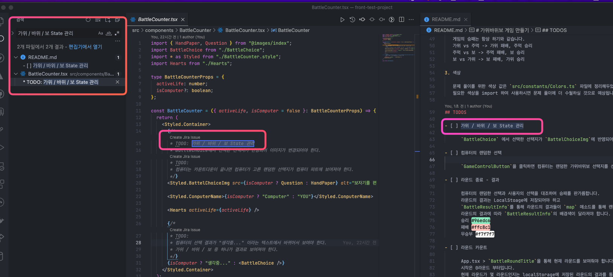
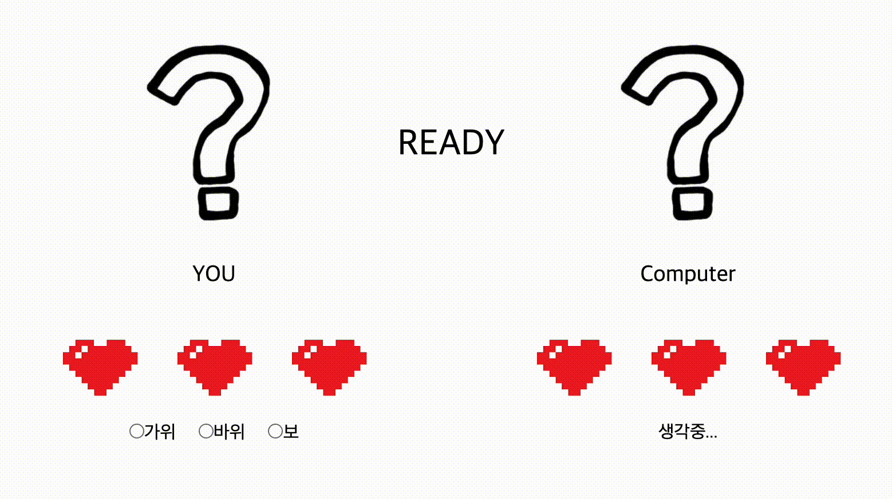
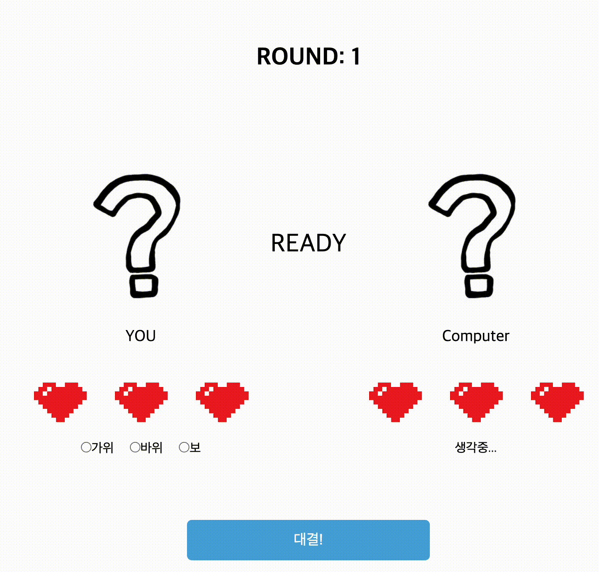
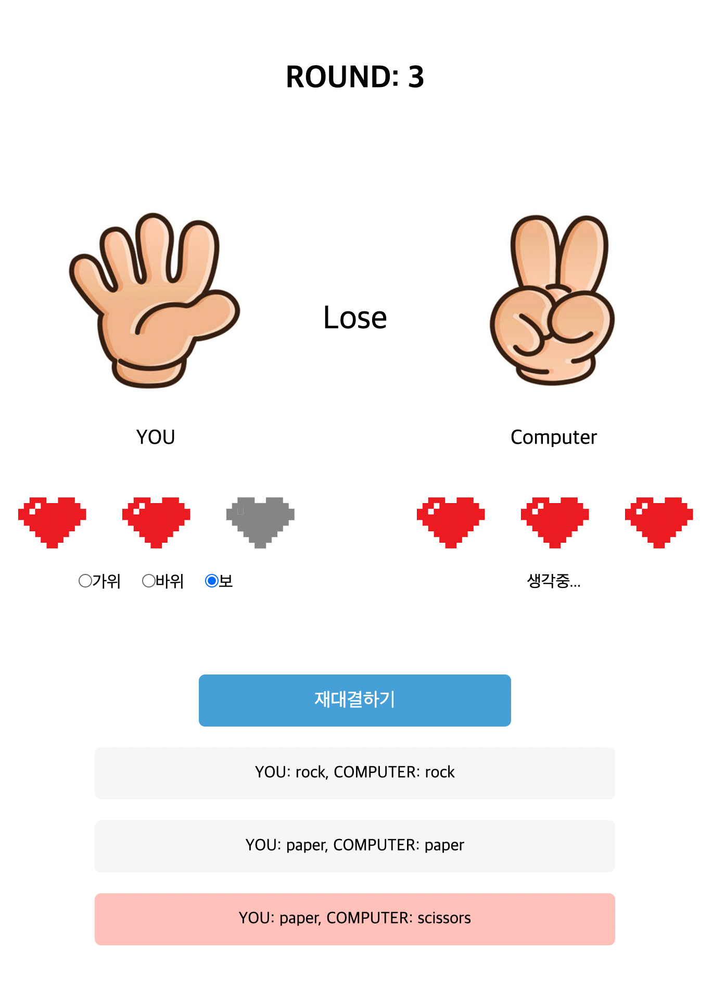
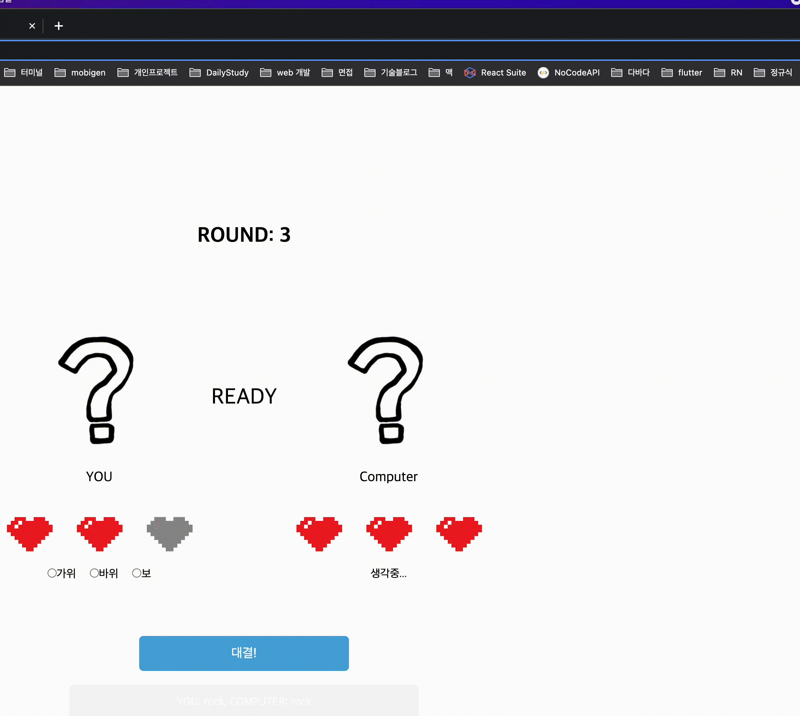

# 가위바위보 게임 만들기

> 이미지 출처 사물궁이 잡학지식

## 과제 개요

React와 Typescript를 활용해 랜덤하게 가위바위보를 내는 컴퓨터와 게임을 해보는 프로젝트입니다.  
요구사항에 맞는 프로젝트를 기간 내에 완성하여 제출해주시길 바랍니다.

### 관련 직무

프론트엔드

### 기술 태그

React, JavaScript, TypeScript, styled-components

### 제출 기한

메일 참조

## 문제 풀이 방법

### 프로젝트 세팅

1. yarn install
   또는 yarn.lock 파일을 삭제한 뒤 npm install
2. git init
   문제 풀이 과정에서 커밋을 해주세요.
   커밋 컨벤션은 따로 지정하지 않았습니다.

### 요구사항 파악

[TODOS](#todos)에 있는 체크 항목별 제목과 동일한 주석을 관련 소스코드에 적어두었습니다.  
에디터의 전체 검색 기능을 활용하여 검색하여 빠른 요구사항을 확인하실 수 있으실 겁니다.

### 참고 사항

퍼블리싱 역량을 파악하는 것이 아닌,  
React와 TypeScript, 그리고 상태관리에 대한 이해도를 확인하기 위한 과제입니다.  
요구사항과 관련없는 수정사항은 평가지표에 반영되지 않습니다.

#### 자주 묻는 질문

1. 상태관리 라이브러리는 redux를 사용하나요, recoil을 사용하나요? (상태관리 라이브러리 문의)  
   A: 상태관리를 포함한 추가적인 라이브러리는 사용하지 않습니다.
2. 시간 내에 제출해도 되나요?
   A: 시간 내에 여러번 제출은 가능하지만, 제출 기간 이후에 제출하는 것은 평가에 반영되지 않습니다.
3. 과제 테스트 결과는 언제 공지되나요?
   A: 과제 제출 이후 담당자가 1시간 이내에 결과 발표일을 공지해드릴 예정입니다.

## 문제 풀이를 위한 배경 지식 및 용어 설명

1. 라운드 / 경기  
   경기가 종료될 때까지의 한 판 한 판을 '라운드' 라고 합니다.  
   예시:

   경기 시작  
   1라운드: 가위 vs 보 -> 승리  
   2라운드: 주먹 vs 가위 -> 승리  
   3라운드: 주먹 vs 가위 -> 승리  
   경기 결과: 당신이 승리하였습니다.

2. 가위바위보의 승패

   가위바위보 게임은 가위 / 바위 / 보 중 하나를 선택해 상대방과 선택지를 비교하는 게임입니다.  
   게임의 승패는 항상 하기와 같습니다.  
   가위 vs 주먹 -> 가위 패배, 주먹 승리  
   주먹 vs 보 -> 주먹 패배, 보 승리  
   보 vs 가위 -> 보 패배, 가위 승리

3. 색상

   문제 풀이를 위한 색상 값은 `src/constants/Colors.ts` 파일에 정리해두었습니다.  
   필요한 색상을 import 하여 사용하시면 문제 풀이에 더 수월하실 것으로 예상됩니다.

## TODOS

- [ ] 가위 / 바위 / 보 State 관리

      `BattleChoice` 에서 선택한 선택지가 `BattelChoiceImg`에 반영되어야 합니다.
      아무것도 선택하지 않는 초기 상태에서는 You도 물음표 이미지가 띄워져야 합니다.

- [ ] 컴퓨터의 랜덤한 선택

      `GameControlButton`을 클릭하면 컴퓨터는 3초 뒤 랜덤한 가위바위보 선택지를 선택합니다.
      선택한 선택지는 `BattleCounter`의 `BattleChoiceImg`의 src로 반영되어야 합니다.

- [ ] 라운드 종료 - 결과

      컴퓨터의 랜덤한 선택과 사용자의 선택을 대조하여 승패를 판가름합니다.
      라운드의 결과는 LocalStoage에 저장되어야 하고
      `BattleResultInfo`를 통해 라운드의 결과들이 `map` 메소드를 통해 렌더링 되어야 합니다.
      라운드의 결과에 따라 `BattleResultInfo`의 배경색이 달라져야 합니다.
      승리 #96edc6
      패배 #ffc8c1
      무승부 #f7f7f7

- [ ] 라운드 카운트

      App.tsx > `BattleRoundTitle`을 통해 현재 라운드를 보여줘야 합니다.
      시작은 0라운드 부터입니다.
      현재 라운드가 몇 라운드인지는 localStorage에 저장된 라운드의 결과를 통해 보여져야 합니다.
      > 라운드는 localstoage에 키 - 값으로 따로 저장하는 것이 아닌 라운드의 결과로 유추하는 방식이어야 합니다.

- [ ] 대결 유효성 검사

      `GameControlButton` (대결!) 버튼이 클릭되었을 때 사용자가 `BattleChoice` 에서 선택한 값이 없다면,
      window.alert를 활용해 "'가위/바위/보' 중 하나를 선택해주세요!" 텍스트를 띄워야 합니다.

- [ ] 라운드 종료 / 경기 종료 - 생명수 차감

      라운드의 결과에 따라서 생명수가 차감되어 `BattleCounter`에 전달되는 `activeLife` props가 1씩 차감되어야 합니다.
      `activeLife` 값 또한 localStoage를 통해 관리되어야 합니다.

- [ ] 라운드 종료 / 경기 종료 - 게임 시작 버튼

      경기를 시작하고 나서는 '재대결하기'로 보여져야 하고
      라운드를 시작하기 전에는 '대결!'로 보여져야 합니다.
      경기가 최종적으로 종료가 되면(어느 한 쪽이라도 생명수가 0이되면) '다시 시작하기'로 보여져야 합니다.
      '다시 시작하기' 버튼의 배경 색상은 #E63C3C 이어야합니다.
      게임 시작 버튼의 텍스트와 배경색은 라운드 진행 상황에 따라 달라져야 합니다.

- [ ] 경기 종료

      경기가 종료되면 window.alert 메소드를 활용하여
      "<컴퓨터가 / 당신이> 승리하였습니다." 를 띄워야합니다.

- [ ] 경기 재시작

      '다시 시작하기' 버튼을 클릭할 경우,
      최초의 상태로 리셋이 되어야 합니다.

### 제출 방법

node_modules 를 제외한 프로젝트 전체를 zip 파일로 압축해  
sw@bigpicture.team 으로 제출해주시면 됩니다.

_꼭 node_modules를 제외하여 제출해주시길 바라며 시간 내에 여러번 제출은 가능하지만, 제출 기간 이후에 제출하는 것은 평가에 반영되지 않습니다._

> 참조에 <zlemzlem5656@bigpicture.team>을 같이 참조
